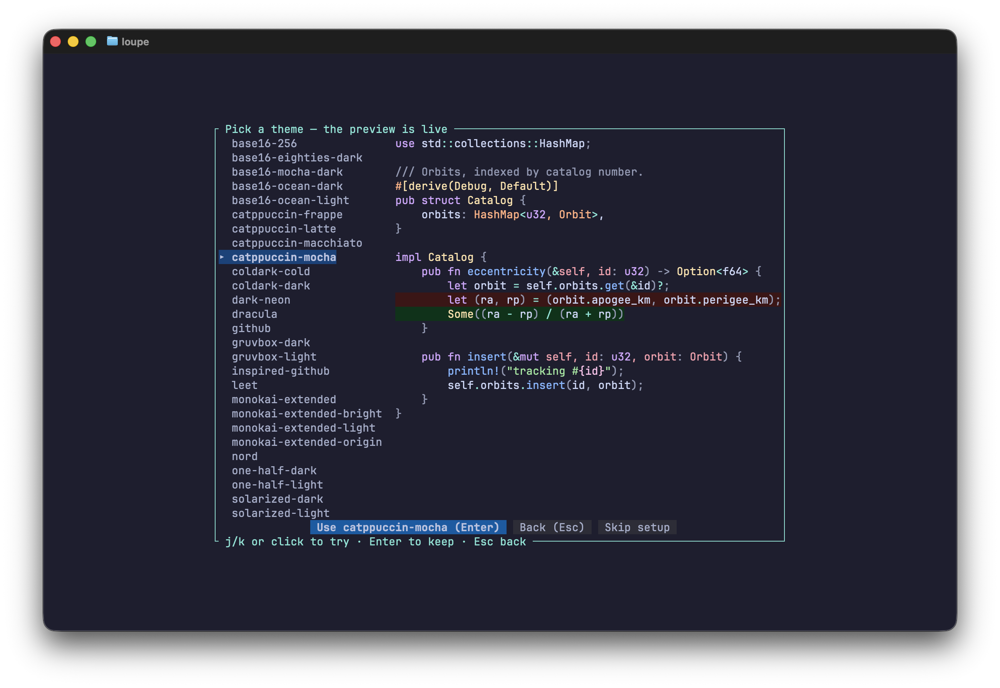

<!-- The same block-letter logo the setup wizard draws (src/wizard.rs). -->

```text
██╗      ██████╗ ██╗   ██╗██████╗ ███████╗
██║     ██╔═══██╗██║   ██║██╔══██╗██╔════╝
██║     ██║   ██║██║   ██║██████╔╝█████╗
██║     ██║   ██║██║   ██║██╔═══╝ ██╔══╝
███████╗╚██████╔╝╚██████╔╝██║     ███████╗
╚══════╝ ╚═════╝  ╚═════╝ ╚═╝     ╚══════╝
```

# 🔍 Loupe — mouse-first PR review in the terminal

[](https://github.com/jjacoblee/Loupe/actions/workflows/ci.yml)
[](https://github.com/jjacoblee/Loupe/releases/latest)
[](LICENSE)

A rich, clickable TUI for reviewing GitHub pull requests **and your own
uncommitted changes**, inspired by the VS Code GitHub Pull Requests
extension. Built with Rust + [ratatui](https://ratatui.rs).

Click through file trees, read syntax-highlighted side-by-side diffs,
post review comments, mark files viewed (synced to GitHub), stage your
work file by file, and fix nits in a real in-terminal editor — without
leaving your terminal or touching a browser.


## Highlights

- **One command, the right view** — `loupe` opens your uncommitted
  changes if you have any, the current branch's open PR if there is one,
  or a clickable picker of the repo's open PRs.
- **Real review tools** — click or drag across diff lines and post
  single- or multi-line review comments straight to the PR via `gh`.
- **Viewed checkboxes that sync** — mark files viewed here, see them
  checked on github.com, and vice versa.
- **Local review with staging** — in local mode the file panel stages
  instead: `[+]` unstaged, `[±]` partially staged, `[✓]` staged. Review
  your diff and build the commit in one pass; unstaging never touches
  your files.
- **Undo a change without leaving the review** — every changed section
  of the diff has a `↺` in the change bar and every file row has one of
  its own. Click the section marker to put just those lines back
  (working tree only — what you staged stays staged), or the file marker
  to take the whole file back to where it started. Both ask first.
- **Keeps up with an agent** — local review re-scans the working tree
  whenever you pause, so files a coding agent rewrites under an open
  review appear without a key press. It never interrupts (no re-scan
  with the editor, a menu or a selection open) and never moves your
  place. `r` or the `⟳` button pulls changes in right now.
- **A top bar that fits** — the toolbar shows the two or three things
  that match what you are doing; `☰` holds the rest, grouped and
  labelled with the key that does the same thing.
- **Editor-grade diffs** — side-by-side or inline, syntax highlighting
  from bat's extended syntax set (32 themes), unchanged stretches folded
  away, pinned gutters with horizontal scrolling for wide lines,
  resizable panels.
- **Vim motions too** — the diff has a cursor row driven by `j`/`k`,
  `Ctrl+D`/`Ctrl+U`, `gg`/`G`, `{`/`}`, `H`/`M`/`L` and friends, with
  `V` line selections for commenting — clicking a line places the same
  cursor, so mouse and keyboard never disagree.
- **Find anything** — `/` searches the open diff as you type (`n`/`N`
  step the matches); `Ctrl+P` fuzzy-matches a file; `#` greps every
  changed file — or the whole repository — in one `git grep`, with
  definitions sorted to the top; `@` lists what's defined in the file.
  A hit in a file the PR doesn't touch opens in the editor, and `Esc`
  puts you back in the diff exactly where you were.
- **Copy out of either side** — drag through the diff to select exactly
  the characters you want, on the old side or the new, and `y` copies
  them. The removed text is still there to take even though it exists
  nowhere on disk. Works over SSH.
- **Real code intelligence, from the tools you already have** — `gd`
  goes to a definition, `gr` lists every reference, `K` shows the type
  and its docs. Loupe drives whichever language server is on your PATH
  (`typescript-language-server`, `gopls`, `rust-analyzer`), starts it on
  demand, and hands it *the text on your screen* rather than the file on
  disk — which matters when the working tree is on another branch.
  Nothing is bundled or installed; `loupe --lsp` says what it found, and
  a language without a server falls back to pattern matching.
- **Edit in place, with the language server attached** — double-click a
  new-side line to open an editor with live incremental highlighting,
  completion (`Ctrl+Space`), type-and-docs at the cursor (`Ctrl+G`),
  go-to-definition (`Ctrl+]`), formatting (`Ctrl+T`), and diagnostics
  that appear as you type rather than after you push. `Ctrl+S` refreshes
  the diff; you commit when you're ready.
- **Fast and non-blocking** — every fetch runs in the background with a
  cancellable spinner; idle CPU is ~zero; PR content is treated as
  untrusted input throughout.
- **Light and dark, without being told** — Loupe asks your terminal for
  its background color at startup and tunes everything to it: diff
  greens and reds that read on white, gutters and chrome that don't
  vanish, and a syntax theme from the matching half of the set. Override
  it with `--light` / `--dark`, the `appearance` config key, or `a` in
  the theme picker.
- **Zero-config start** — the first launch opens a setup wizard: pick a
  theme from a live preview, pick a default mode, and it writes your
  config for you. Press `t` any time for the in-app theme picker — 32
  themes (all four Catppuccin flavors, Dracula, Nord, Gruvbox, …),
  previewed live and saved on Enter.
- **No tokens to manage** — all GitHub access goes through your existing
  [`gh`](https://cli.github.com/) login.



## Install

**Prebuilt binaries** for Linux, macOS, and Windows are on the
[releases page](https://github.com/jjacoblee/Loupe/releases/latest) —
unpack and put `loupe` on your `PATH`.

**With cargo** (any recent stable [Rust](https://rustup.rs)):

```sh
cargo install --git https://github.com/jjacoblee/Loupe
```

> Loupe is not on crates.io yet — the crate name `loupe` there belongs to
> an unrelated project, so use the `--git` form.

**From source:**

```sh
git clone https://github.com/jjacoblee/Loupe && cd Loupe
cargo build --release   # binary at target/release/loupe
```

You'll also need `git` and an authenticated GitHub CLI (`gh auth login`),
plus any modern terminal with mouse support.

## Quick start

```sh
cd your-repo
loupe           # local changes if any, else the PR flow
loupe --pr      # straight to pull requests
loupe --local   # review uncommitted work even when the tree is clean
```

Opening a PR from the picker offers **Checkout & review** (switches your
working tree, enables editing) or **Review only** (no checkout —
commenting works, editing is off). If your current branch already has an
open PR — say, in a per-branch worktree — it opens directly; press `b`
for the list.

The first launch runs a quick setup wizard (theme + default mode, saved
for you). Then: click files, read diffs (`v` toggles split/inline, `z`
folds), select lines (click, drag, or `V` + motions) and `c` to comment,
`e` to edit, `x` to mark viewed or stage, `r` to refresh, `m` (or `☰`)
for the menu, `?` for help, `q` to quit — the full keyboard and mouse
reference is in
[docs/keys-and-mouse.md](docs/keys-and-mouse.md).

## Documentation

| | |
| --- | --- |
| [Getting started](docs/getting-started.md) | Requirements, installation, first run, troubleshooting |
| [Reviewing pull requests](docs/reviewing-prs.md) | Picker, checkout modes, comments, viewed sync, editing |
| [Reviewing local changes](docs/local-changes.md) | Local mode and the staging column |
| [Configuration](docs/configuration.md) | Config file, all keys, CLI flags, themes |
| [Keyboard & mouse reference](docs/keys-and-mouse.md) | Every binding and clickable control |
| [Architecture](docs/architecture.md) | How Loupe works inside — start here to contribute |

Configuration lives in `~/.config/loupe/config.toml` plus an optional
per-repo `.loupe.toml` (see
[`config.example.toml`](config.example.toml)) — upstream `org` for fork
workflows, default mode, light/dark `appearance`, syntax themes, and
panel width. You'll rarely
edit it by hand: the setup wizard and theme picker write it for you, and
`loupe setup` re-runs the wizard whenever you want.

## Contributing

Contributions are welcome — bug reports, docs, and code. Start with the
[contribution guide](CONTRIBUTING.md) and the
[architecture overview](docs/architecture.md). This project follows a
[code of conduct](CODE_OF_CONDUCT.md); security issues go through the
[security policy](SECURITY.md).

## License

[MIT](LICENSE)
