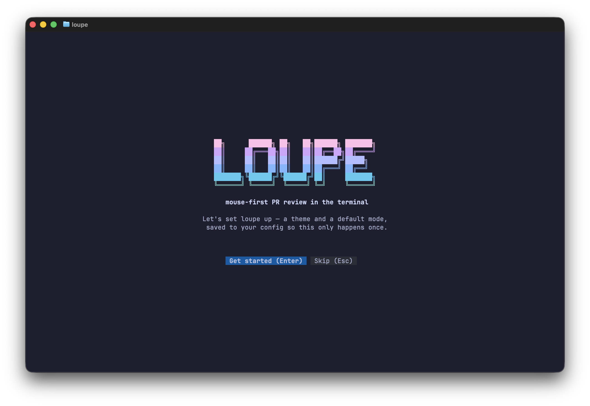
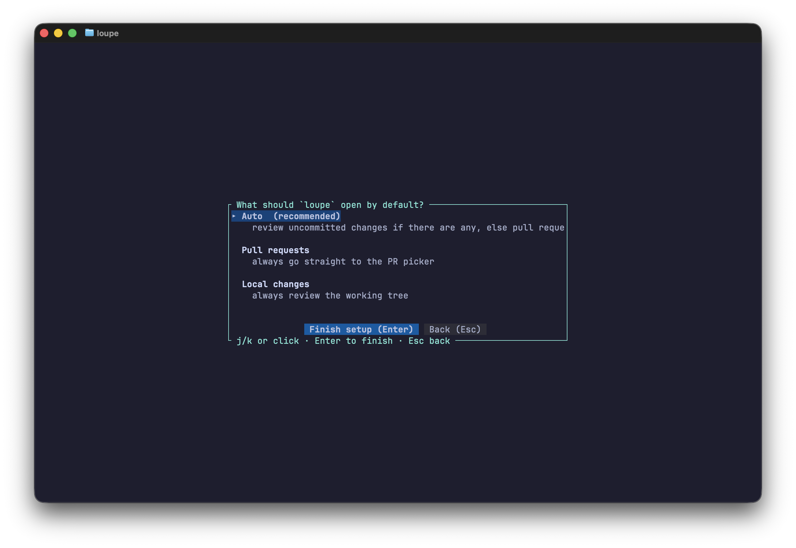
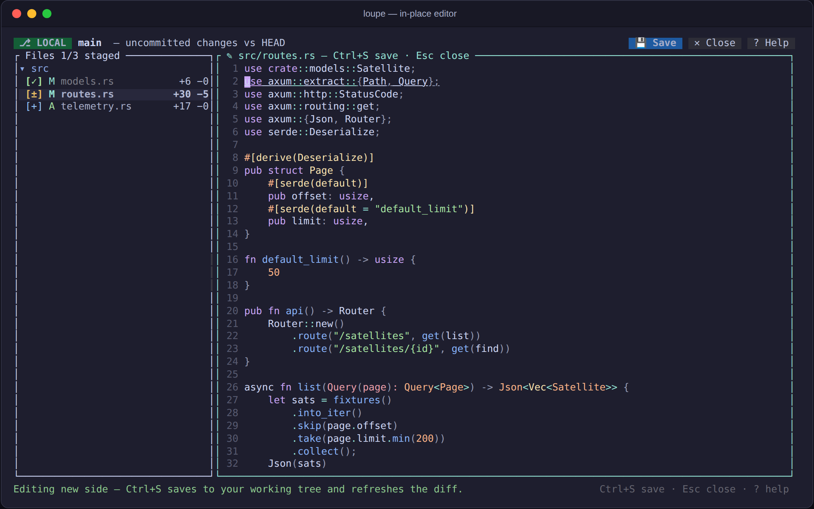

# Getting started

## Requirements

- **git** — Loupe drives it under the hood for diffs, staging, and
  fetching PR refs.
- **The [GitHub CLI](https://cli.github.com/) (`gh`)**, already
  authenticated: run `gh auth login` once. Loupe never handles tokens
  itself — all GitHub access goes through your existing `gh` login.
- **A local clone** of the repository you want to review. Loupe runs from
  inside it (any subdirectory works).
- **A terminal with mouse support.** Any modern terminal qualifies:
  iTerm2, Terminal.app, kitty, WezTerm, Alacritty, Windows Terminal,
  GNOME Terminal, …

## Installation

### Prebuilt binaries

Download the archive for your platform from the
[latest release](https://github.com/jjacoblee/Loupe/releases/latest),
unpack it, and put `loupe` somewhere on your `PATH`:

```sh
tar xzf loupe-*.tar.gz
install -m 755 loupe ~/.local/bin/   # or anywhere on your PATH
```

Each release ships archives for Linux (x86_64 and arm64), macOS (Intel
and Apple silicon), and Windows, plus a `SHA256SUMS` file to verify your
download:

```sh
shasum -a 256 -c SHA256SUMS --ignore-missing
```

### With cargo

Loupe is a standard Rust project — a recent stable
[Rust toolchain](https://rustup.rs) is all you need:

```sh
cargo install --git https://github.com/jjacoblee/Loupe
```

> **Note:** Loupe is not on crates.io yet (the crate name `loupe` is taken
> by an unrelated project), so `cargo install loupe` installs something
> else. Use the `--git` form above.

### From source

```sh
git clone https://github.com/jjacoblee/Loupe
cd Loupe
cargo build --release
./target/release/loupe --help
```

The release profile enables LTO and a single codegen unit, so the
optimized build takes a few minutes the first time — syntax highlighting
gains measurably from it.

## First run

`cd` into a clone of any GitHub repository and run:

```sh
loupe
```

The very first launch opens a short **setup wizard**: pick a syntax
theme from a live preview (Catppuccin Mocha is the default), choose what
`loupe` should open by default, and — if you have a coding agent on this
machine — let loupe tell that agent which lines you are reading. The
choices are saved to your config, and you'll never see the wizard again
unless you ask for it with `loupe setup`.

The agent step only appears when loupe finds `~/.claude` or `~/.codex`.
It adds one hook and keeps every hook already there; see
[the context provider](agent-context.md). Press `s` to move past it, or
run `loupe ctl install` later.





After that, what opens depends on the state of your working tree:

1. **Uncommitted changes** (staged, unstaged, or untracked files) — Loupe
   opens them for review immediately. This is
   [local-changes mode](local-changes.md); a green `⎇ LOCAL` badge in the
   top bar tells you you're reviewing your own working tree.
2. **Clean tree, current branch has an open PR** — that PR opens
   directly in editable mode (handy if you use per-branch worktrees or
   `gh pr checkout`).
3. **Otherwise** — the PR picker: a clickable list of the repository's
   open pull requests.

To skip the working-tree scan and go straight to pull requests:

```sh
loupe --pr
```

To review local changes even when the tree is clean:

```sh
loupe --local
```

You can make either behavior the default in the
[config file](configuration.md).

## A 60-second tour

- **Left panel**: the changed files, as a collapsible tree (or a flat
  list — click the `Tree`/`Flat` buttons). Click a file to open its diff.
  The icon column on the left is the *viewed* checkbox on a PR (syncs to
  GitHub) or the *staging* control in local mode.
- **Right panel**: the diff — side-by-side or stacked inline (`v`, or
  `☰ → Switch to inline`), with editor-grade syntax highlighting. Long unchanged
  stretches fold away; click a `··· N unchanged lines ···` row to expand.
- **Drag the divider** between the panels to resize; double-click it to
  reset.
- **Click a diff line** (or drag over several) and press `c` or click
  `💬 Comment` to write a review comment.
- **Double-click a line on the new side** (or press `e`) to edit the file
  in place with the same syntax colors, then `Ctrl+S` to save.

  

- **Press `t`** (or click 🎨) any time to switch themes — the picker
  previews live and saves your choice.
- **Press `m`** (or click `☰`) for everything the top bar left out,
  grouped and labelled with the key that does the same thing. The menu is
  the way to learn the keys.
- Press `?` at any time for the built-in help overlay, and `q` to quit.

## The next 60 seconds

The tour above is one file and one diff. These are the parts that make a
long review shorter — all of them work on a pull request and on your own
changes alike.

- **Send one review, not ten notifications.** `Ctrl+S` in a comment draft
  *holds* it. `R` opens the review box: write a summary, pick **Comment**,
  **Approve** or **Request changes**, and `Ctrl+S` sends the lot as one
  GitHub review. See [reviewing pull requests](reviewing-prs.md#the-review-box).
- **Find anything** without leaving the review: `/` searches the open
  diff, `Ctrl+P` matches a file by name, `#` greps the repository, and
  `@` lists what the file defines. See [Find](keys-and-mouse.md#find).
- **`gd`, `gr`, `K`** go to a definition, list references, and say what a
  symbol is — driven by whichever language server is already on your
  PATH. `loupe --lsp` says what it found. See
  [language servers](keys-and-mouse.md#language-servers).
- **`B` opens the blame pane** between the file panel and the diff: who
  last touched each line, how long ago, and the pull request it landed
  in. See [the blame pane](keys-and-mouse.md#the-blame-pane).
- **`P` reads a markdown file as a document** rather than as markup, and
  re-renders it when an agent rewrites it. See
  [markdown preview](keys-and-mouse.md#markdown-preview).
- **`=` pins the file you are on** to a row of tabs that survives
  quitting, and dragging a file onto the window pins and opens it from
  anywhere on the machine. See [pinned files](keys-and-mouse.md#pinned-files).
- **`` ` `` swaps** between the pull request and your own uncommitted
  changes, keeping your place in both. See
  [swapping between the two reviews](keys-and-mouse.md#swapping-between-the-two-reviews).
- **A stopped merge takes over the review.** Conflicted files sort to the
  top and the diff shows our side against theirs, with the marker lines
  gone; `o` resolves one. See
  [merge conflicts](local-changes.md#merge-conflicts).

Full reference: [keyboard & mouse](keys-and-mouse.md).

## Troubleshooting

- **"gh: command not found" or auth errors** — install the
  [GitHub CLI](https://cli.github.com/) and run `gh auth login`. Loupe
  reports the underlying `gh` error in the status bar.
- **No mouse response** — make sure your terminal has mouse reporting
  enabled (some multiplexers need it turned on, e.g. `set -g mouse on`
  in tmux).
- **Files render in a single color** — the file type may not be in the
  bundled syntax set, or your theme is very muted; try another theme via
  `loupe --themes` and the `theme` config key.
- **Everything shows as "added" in a shallow clone** — old-side content
  comes from the merge base; if the clone doesn't have it, deepen the
  clone (`git fetch --unshallow`).
- **Config errors on startup** — Loupe refuses to start on a typo'd
  config key and prints the offending file and key before the terminal
  enters raw mode. See [configuration](configuration.md).
