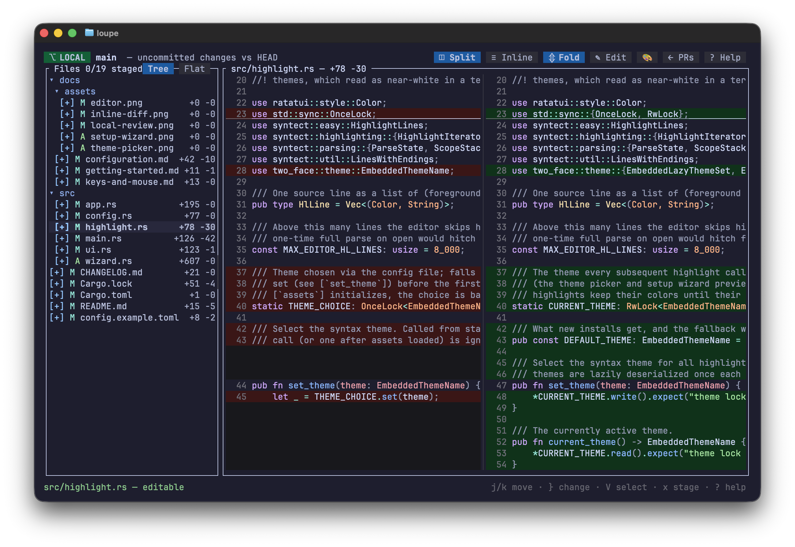

# Reviewing local changes

Loupe reviews your own uncommitted work with the same UI it uses for pull
requests — the same tree, diffs, folding, and editor — plus a staging
column, so you can review and stage a commit in one pass.



## When local mode opens

With no flags, `loupe` scans the working tree first and opens local
review whenever there is uncommitted work; only a clean tree falls
through to the pull-request flow. You can steer this:

- `loupe --local` (or `-l`) — review local changes even when clean.
- `loupe --pr` (or `-p`) — skip the scan, go straight to PRs.
- `mode = "local"` / `"pr"` / `"auto"` in the
  [config file](configuration.md) sets the default; command-line flags
  always win.
- From the PR list, press `l` or click `⎇ Local changes` to switch into
  local mode.

"Uncommitted" means everything different from `HEAD`: staged changes,
unstaged changes, and untracked files (which show as added). It is a
working-tree review, not a branch-vs-main review.

Local mode announces itself with a green `⎇ LOCAL` badge and the branch
name in the top bar.

## Ahead of and behind the upstream

Next to the branch name, Loupe shows how far you have drifted from the
branch you track:

```
 ⎇ LOCAL  feature  ↑3 ↓2 origin/feature  — uncommitted changes vs HEAD
```

- `↑3` — three commits here that the upstream does not have. Push them.
- `↓2` — two commits upstream that you do not have. Pull or rebase.
- `≡ origin/feature` — level with the upstream, nothing either way.

The upstream is whatever `git` has configured for the branch, and
`origin/<branch>` when the branch tracks nothing. With neither, the
counts are left off. They come from `git rev-list --left-right --count`
against the ref you already have, so nothing is fetched — run `git fetch`
(or `r` after one) to bring the numbers up to date.

## Merge conflicts

A merge, rebase, cherry-pick, or revert that stops on a conflict is the
one thing that outranks everything else in the panel, so Loupe puts it
first and says how to finish.

### Finding them

- The badge becomes `⚠ MERGE` — or `REBASE`, `CHERRY-PICK`, `REVERT` —
  in orange, with the operation named: *"resolve the conflicts to finish
  the rebase"*.
- Conflicted files sort to the top of the file panel, in both the tree
  and the flat view, under a red `⚠ N MERGE CONFLICTS` heading. They are
  not repeated in the tree below it.
- Each one carries a red `[!]` icon and a red `!` status letter. The
  `+`/`−` counts are left blank: they would describe the marker text git
  wrote, not a change anyone made.
- The panel and the diff both get an orange border while a conflict is
  open.

### Reading them

Open a conflicted file and the diff shows **your version on the left and
their version on the right**, with the `<<<<<<<`, `=======`, and
`>>>>>>>` lines stripped out. The title names both branches:

```
⚑ src/app.py — 2 conflicts · ◀ HEAD │ feature ▶
```

Every line the two branches agree on is in both sides, so it reads as a
context row and folds away; every conflict is a changed section. That
means the whole diff view already works on it:

- `}` and `{` walk from conflict to conflict.
- `z` folds the agreed stretches; `v` switches to inline.
- `/` searches, syntax colors are correct on both sides (they are real
  file text, not marker soup).
- A `⚑` in the change bar marks the first row of each conflict, with a
  bar down the rest of it.

The blame pane stands down while a conflict is open: its line numbers
would point at the working-tree file, which still has the markers in it.

### Resolving them

Press `o` (or click the `⚑`, or the `[!]` in the file panel) for the
resolve menu:

| Key | What it keeps |
| --- | --- |
| `o` | **Ours** — the version on the branch you are on |
| `t` | **Theirs** — the version being merged in |
| `b` | **Both** — our lines, then theirs |
| `a` | **The common ancestor** — only when git wrote one (`diff3` / `zdiff3` conflict style) |
| `O` / `T` | Ours / theirs for *every* conflict in the file at once |
| `e` | Open the raw file, markers and all, in the editor |
| `x` | Mark it resolved (`git add`) — for a resolution you made by hand |

Each choice rewrites **only that conflict**; the others keep their
markers. When the last one in a file is settled, Loupe stages the file
with it — git treats a path as conflicted until it is added, so a file
left unstaged would keep warning you. Press `x` to take it back out.

The file list re-scans itself after each resolution, so a resolved file
leaves the conflict group on its own and the status line tells you what
is left and how to finish:

```
✔ Resolved src/app.py — kept theirs, and staged it. Finish with `git rebase --continue`.
```

### Conflicts with no markers

Some conflicts cannot be written as markers — one side deleted the file
and the other changed it, for example. Those still show in the panel with
the same red warning, and the resolve menu offers the two answers that
come from the index instead of from the file text: **take our whole
file** and **take their whole file**. Where the chosen side deleted the
file, resolving to it removes the file.

Reverting (`u` / `U` / the `↺` markers) is refused on a conflicted file:
`git checkout HEAD -- <path>` mid-merge throws the merge away for that
path. `u` opens the resolve menu instead.

## Staged and unstaged

In local mode the file panel is in two halves. `STAGED` is at the top —
what `git commit` would take right now — and `UNSTAGED` is below it.
Stage a file and its row moves up; unstage it and the row moves back
down.

```
┌ Files 2/7 staged ──────────── Tree  Flat ┐
│ ▾ STAGED 2                         ↩ all │
│   [✓] M  src/app.rs           +48 −6   ↺ │
│   [±] M  src/ui.rs            +12 −0   ↺ │
│ ▾ UNSTAGED 5                       ✚ all │
│   [+] M  docs/README.md        +3 −1   ↺ │
└──────────────── Change │ Files │ Commits ┘
```

- **Click a heading** to fold that section away. The heading stays, with
  its count, so you can always see how the change is divided.
- **Click `✚ all`** to stage everything, **`↩ all`** to take it all back
  out. `X` does the same from the keyboard: it stages what is left, and
  unstages everything when there is nothing left to stage.
- A **partly staged** file is in the index and in the working tree at
  once. It is listed once, under `STAGED`, with the `[±]` icon that says
  the rest of it is not.

### The staging column

The panel's icon column stages instead of marking viewed. Click the icon
(or press `x`) to toggle:

| Icon | Meaning |
| --- | --- |
| `[+]` | Not staged — click to `git add` the file |
| `[✓]` | Fully staged — click to take it back out of the index |
| `[±]` | Partially staged — some hunks in the index, some only in the working tree |

Details worth knowing:

- **Unstaging never touches your files.** It is `git reset -- <path>`:
  the index moves, the working tree doesn't.
- Staging state comes from `git status` itself, so partial staging
  (e.g. from `git add -p` elsewhere) is always shown faithfully.
- Renames stage and unstage as a unit — both the old and new path move
  together.
- The panel title shows progress: `Files 3/7 staged`, counting what is in
  the index — the same number the `STAGED` heading shows.
- Works from any subdirectory of the repo, and in a brand-new repository
  with no commits yet.
- **Staging everything is refused while a merge conflict is open.** git
  treats a path as conflicted until it is added, so `git add -A` mid-merge
  would mark every conflict resolved without anybody resolving one.

Staging toggles are optimistic and re-read the real index in the
background; on failure the icon reverts and the error is shown.

## Putting work aside — the stash

`S`, or `📦 Stash…` in the ☰ menu, opens the stash menu. It asks the three
questions git asks:

| Line | What it takes |
| --- | --- |
| `Stash the tracked changes` | Edits to files git already knows about |
| `Stash everything, untracked files too` | The above, plus new files (`--include-untracked`) |
| `Stash the staged files only` | Just what is in the index (`--staged`), leaving your unstaged edits in place |

**Every one of them asks for a name first.** Type one and it is what
`git stash list` shows; press Enter with the box empty and git names it
itself (`WIP on <branch>`). So "stash with a name" is not a fourth way to
stash — it is the same three, named.

Below those lines the menu lists every stash you have, newest first, with
its name and how long ago it was made. Click one for what can be done
with it:

| Line | Action |
| --- | --- |
| `Apply it and keep the stash` | `git stash apply` — the work comes back, the stash stays |
| `Apply it and drop the stash` | `git stash pop` |
| `Drop it` | `git stash drop` — asks nothing back, and cannot be undone from loupe |

Applying tries to put the index back the way it was (`--index`) and falls
back to restoring the work as unstaged edits when git cannot replay it.

git calls an empty stash a success and says "No local changes to save" on
its way out. Loupe turns that into an error, because a menu click that
did nothing should not look like one that worked.

`--staged` needs git 2.35 or later.

## Commits you have not pushed

The change pane shows what is uncommitted, and nothing else. Press `F`
twice — or click `Commits` on the panel's bottom border — for the commits
this branch has that the upstream does not. Open one to see its files,
and open a file to read that commit's diff. See
[Commits not pushed yet](keys-and-mouse.md#commits-not-pushed-yet).

## Putting changes back

Each changed section of the diff carries a `↺` in the change bar at the
left of the pane; each file row carries one at its right-hand end. The
section marker (or `u`) rewrites just those lines in the working tree and
leaves the index alone; the file marker (or `U`) runs
`git checkout HEAD -- <path>`, which puts the index back too and drops
the file out of the list. An untracked file has no `HEAD` version to
restore, so reverting it deletes it — the prompt says which of the two is
about to happen, and nothing moves until you confirm.

## What's different from PR review

- The diff compares your working tree against `HEAD`; the index moving
  doesn't change what's on screen.
- Editing is always on — these are your files. Double-click a line or
  press `e`, edit, `Ctrl+S`, and the diff refreshes.
- Commenting is disabled (there is no PR to comment on); the `💬 Comment`
  button is hidden and `c` explains why.
- Nothing syncs to GitHub — no viewed-state sync, no network calls beyond
  what git itself does.

## Keeping up with an agent

The working tree is not only yours. A coding agent in another pane, a
`cargo fix`, a rebase in a second terminal — any of them can rewrite the
files under an open review, and nothing in a terminal tells Loupe that
it happened.

So local review re-scans by itself. About 2 seconds after your last key
press or mouse move, and at most once every 5 seconds, Loupe re-reads
the changed-file list and reloads the open file. Your scroll position,
your cursor row and your folds all survive; the status line says
`⟳ <path> updated with the latest changes.` when something moved, and
says nothing at all when nothing did.

The re-scan waits for you. It stands down while the editor is open,
while any overlay or menu is open, while lines are selected, and during
a drag or a panel resize — a refresh that pulled a selection out from
under you would be worse than a stale diff.

Two ways to take over:

- **`r`, or the `⟳` button in the top bar** — re-scan now. Use it when
  the idle timer is too slow for you, or when you have been clicking
  around for a while and suspect the diff is behind.
- **`☰ → Refresh while idle`** — turn the polling off for this session.
  `auto_refresh = false` in your config turns it off for good.

### Is it redoing its own work?

Reading an agent's diff, the hard question is not *what does this do* —
it is *have I seen this line before*. A hundred green lines look the same
whether they are new work or the third attempt at the same function.

`s` answers it. It layers three versions of the file — the base branch,
what is already pushed (or committed, before you push), and the working
tree — and paints each row by the step that wrote it: purple for what is
already on the remote, green and red for what is new since, **amber for a
line this change has now written twice**. The title counts the amber, so
the answer arrives before you read a word:

```
 src/api.rs — +61 −18 · the whole stack · ‡ 12 lines written twice
```

Twelve lines rewritten twice in one file is thrash. Zero is progress.
See [Layers](keys-and-mouse.md#layers--what-you-already-changed-and-what-is-new).

## The rest of the review

These work the same way here as they do on a pull request, so they are
written up once in the reference:

| What | Where |
| --- | --- |
| Pin the files you keep returning to, and read files from outside the repository | [Pinned files](keys-and-mouse.md#pinned-files) |
| Read the plan file an agent is writing, as a document | [Markdown preview](keys-and-mouse.md#markdown-preview) |
| See who last touched each line — your uncommitted lines get their own color | [The blame pane](keys-and-mouse.md#the-blame-pane) |
| Search this diff, a file by name, text in the repository, or definitions | [Find](keys-and-mouse.md#find) |
| Go to a definition, list references, ask what a symbol is | [Language servers](keys-and-mouse.md#language-servers) |
| Copy exact characters out of either side of the diff | [Copying](keys-and-mouse.md#copying) |

**`` ` `` swaps to the pull request** for the current branch and back,
keeping your place in both. See
[swapping between the two reviews](keys-and-mouse.md#swapping-between-the-two-reviews).

## A typical flow

1. Hack until the feature works; run `loupe`.
2. Walk the file list top to bottom, reading each diff. Fix small things
   in place with the editor.
3. Stage each file as you finish reviewing it — `x`, or click the icon.
   It moves up into `STAGED`, so what is left below is what you have not
   read yet. Something you didn't mean to keep? `↺` beside it puts it
   back. Hand a fix to an agent and keep reading: its edits appear on
   their own, or press `r` to pull them in now.
4. Something half-finished in the way? `S` puts it aside with a name, and
   the same menu brings it back later.
5. Quit (`q`) and `git commit`: the index already contains exactly what
   you reviewed.
