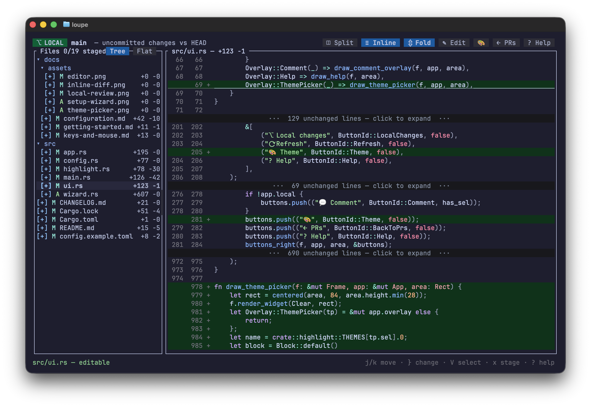

# Reviewing pull requests

## Opening a PR

Run `loupe` (or `loupe --pr` to skip the local-changes scan) inside a
clone of the repository.

- **The PR picker** lists the repository's open pull requests — number,
  title, author, and branch. Click one to open it, or press `r` to
  refresh the list.
- **Branch auto-open**: if the branch you have checked out already has an
  open PR, Loupe skips the picker and opens that PR directly in editable
  mode. This makes `loupe` a one-keystroke review tool in per-branch
  worktree workflows. Press `b` to get back to the full PR list at any
  time.
- **Fork / multi-org setups**: set the `org` config key to list and open
  PRs against an upstream organization instead of your clone's own owner
  — see [configuration](configuration.md).

Everything loads in the background: a spinner in the status bar shows
what's loading and for which PR, the UI stays responsive, and `c` or
`Esc` cancels a load you didn't want.

## Checkout & review vs. review only

When you open a PR from the picker, Loupe asks how you want to review it:

- **Checkout & review** — checks out the PR branch (via `gh pr checkout`)
  and enables editing. Your working tree switches to the PR's branch.
- **Review only** — no checkout: Loupe fetches the PR's head ref into
  `refs/prtui/*` without touching your working tree. Reading diffs and
  commenting work; editing is off.

If the PR's branch is already checked out (the auto-open case), the
redundant checkout is skipped and editing is on.

## The file panel

Changed files appear as a collapsible folder tree — single-child
directory chains are compressed (`src/app/jobs`) to keep the tree
shallow. Toggle to a flat list with the `Tree`/`Flat` buttons on the
panel border. Each file shows its status (`A`/`M`/`D`/`R`) and +/−
counts.

**Viewed checkboxes.** Every file has a checkbox (`[ ]` / `[✓]`); click
it or press `x` to mark the file viewed. Viewed state syncs to GitHub in
the background — the PR page shows the same files checked, and files you
already marked on the website arrive checked here. Syncs are optimistic:
if one fails, the checkbox reverts and the error shows in the status bar.

The panel is resizable: drag the divider, press `<` / `>`, or
double-click the divider to reset. A starting width can be set with the
`file_panel_width` config key.

## The diff view

- **Layouts**: side-by-side or inline stacked. Press `v`, or pick
  **Switch to inline** / **Switch to split** from the `☰` menu.

  
- **Syntax highlighting** is computed per file in the background using
  the same extended syntax set as [bat](https://github.com/sharkdp/bat),
  with green/red backgrounds layered underneath added/removed lines. Pick
  a theme with the `theme` config key (`loupe --themes` lists all 32).
- **Folding**: unchanged stretches collapse to a
  `··· N unchanged lines ···` row; click to expand. Expanded runs keep a
  `⌃⌃⌃ … click to fold ⌃⌃⌃` header to put them back. `☰ → Fold unchanged lines`
  (or `z`) re-folds all expanded runs first, then toggles the whole file.
- **Horizontal scrolling**: long lines scroll sideways with `h`/`l` or
  `←`/`→`, a horizontal trackpad swipe, or the wheel with a modifier
  held (Shift by convention; Alt and Ctrl also work since terminals
  differ in what they pass through). Line-number gutters stay pinned,
  the title shows the current column, and `0` snaps back to the first
  column.
- **Vim motions**: a cursor row (underlined) moves with `j`/`k`,
  `Ctrl+D`/`Ctrl+U`, `Ctrl+F`/`Ctrl+B`, `gg`/`G`, `{`/`}` (previous/next
  run of changes), and `H`/`M`/`L`; `Ctrl+E`/`Ctrl+Y` scroll without
  moving the cursor, and `Enter`/`Space` fold or expand the run at the
  cursor. Clicking a line places the same cursor, so mouse and keyboard
  never disagree.

## Review comments

1. Select lines on either the old or new side: click a diff line, drag
   across several — or press `V` to start a line selection and extend it
   with the motions (`Esc` cancels).
2. Click `💬 Comment` or press `c` (with no selection, `c` comments on
   the cursor line).
3. Write the comment and post — it goes to the PR through `gh` as a real
   review comment, single- or multi-line.

Two GitHub-imposed rules to know:

- Comments anchor to the PR's **head commit**. After you edit and save a
  file locally, commenting on that file is blocked until you commit &
  push (or reload) — otherwise GitHub would pin the comment to the wrong
  lines. Loupe tracks this per file and tells you in the status bar.
- GitHub only accepts comments on lines inside the PR's diff hunks. A
  comment far outside a hunk is rejected by the API; the error is shown
  in the status bar.

## Editing the new side

Double-click a line on the new side (or press `e` / `i` at the cursor
line, or click `✎ Edit`) to open a real editor over the working-tree
file — available when the PR branch is checked out:

- Click to place the cursor, drag to select, type, undo/redo
  (`Ctrl+Z` / `Ctrl+Y`), `Ctrl+S` to save, `Esc` to close (twice to
  discard unsaved changes).
- The editor uses the same syntax colors as the diff, re-highlighted
  incrementally as you type, so even large files stay responsive. (Files
  over 8,000 lines skip editor highlighting to keep opening instant.)
- Saving refreshes the diff immediately. Edits only touch your local
  working tree — **you** commit and push when ready; Loupe never commits
  for you.

## Notes & limits

- Old-side content is resolved from the merge base of the PR's base and
  head. In shallow clones some base content may be unavailable, in which
  case those files render as fully added.
- Loupe requires PRs to be **open**; the auto-open path ignores closed
  and merged PRs.
- With an `org` configured, branch auto-open matches upstream PRs by head
  branch name — exact for same-repo branches, best-effort for cross-fork
  heads.
